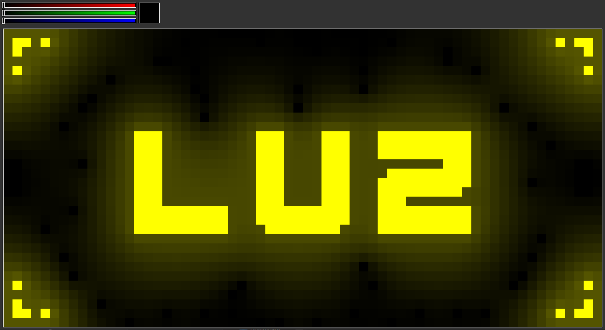
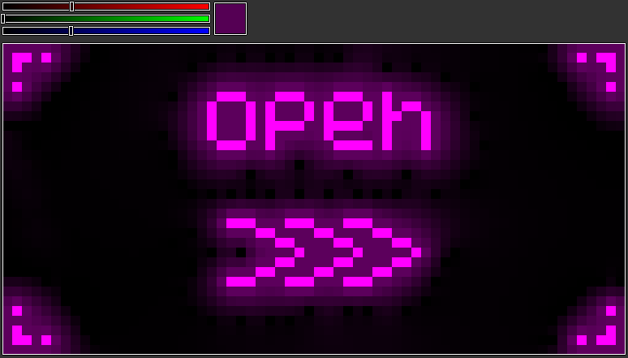
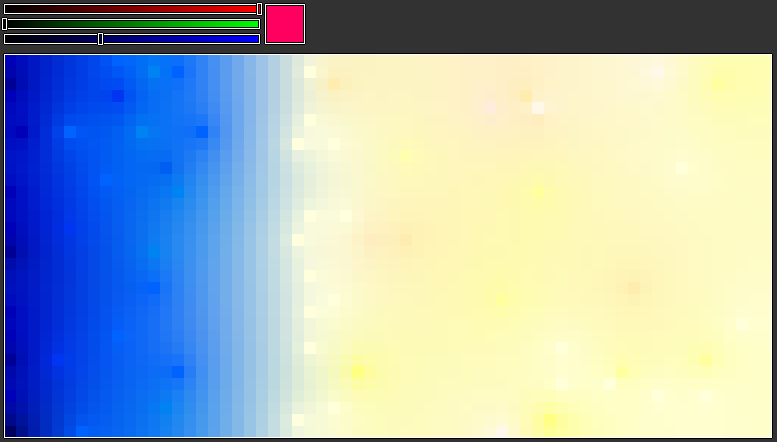
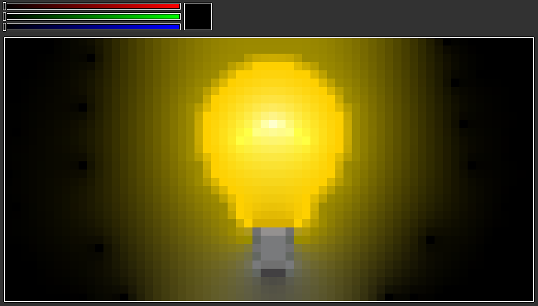
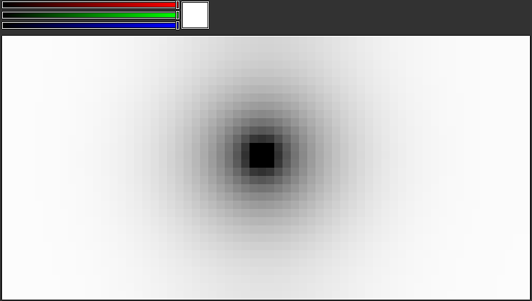

# Glowing Painter

<!-- LOGO -->

  
  <h3 align="center">Simulação em Python de particulas que emitem cor</h3>
  

    <a href ="https://youtu.be/Oo_BPsrD5LE">
      Video de demonstração!
    </a>
  

<!-- TABELA DE CONTEUDO -->

  
Conteúdos

  <ol>
    <li>
      <a href="#sobre-o-projeto">Sobre o Projeto</a>
      <ul>
        <li><a href="#criado-com">Criado com</a></li>
      </ul>
      <ul>
        <li><a href="#regras">Regras</a></li>
      </ul>
      <ul>
        <li><a href="#exemplos">Exemplos</a></li>
      </ul>
    </li>
    <li>
      <a href="#como-utilizar">Como utilizar</a>
      <ul>
        <li><a href="#download">Download</a></li>
      </ul>
      <ul>
        <li><a href="#comandos">Comandos</a></li>
      </ul>
      <ul>
        <li><a href="#dicas">Dicas</a></li>
      </ul>
    </li>
  </ol>

  

# Sobre o Projeto

Esta simulação nasceu de uma ideia de criar um sistema de particulas que interferem no campo uma da outra. Um destes testes com particulas se provou interessante para a criação de arte. 

Mudando a ideia de campo para cor este projeto foi criado. Após alguns ajustes as particulas se tornaram pixels em um grande canvas interativo e dinamicamente simulado, onde todos quadrados de um grid interagem com os quadrados a sua volta, alterando a cor destes.

## Criado com

O pacote [PyGame](https://www.pygame.org/) foi utilizado para o desenvolvimento de toda a interface gráfica deste projeto.

## Regras

O tabuleiro desta simulação é um grid composto por 64x32 quadrados que possuem cada um uma cor.

A cada frame da simulação a cor de cada quadrado se torna a média das cores dele e dos quadrados a sua volta. Desta forma se há um só ponto branco em um fundo preto, eventualmente toda a tela ficará um pouco mais clara, visto que os pontos pretos vão escurecer o branco, mas o branco vai esclareces os pontos pretos.

É possível criar pontos que não são afetados pelas cores a sua volta. Esses pontos, chamados de "pontos de cor", espalham a propria cor sem que a sua propria cor mude.

## Exemplos

* Placa neon de "OPEN"

* Praia

* Lâmpada

* Ponto único preto em fundo branco

# Como utilizar

## Download

O Download do executavel para Windows pode ser obtido neste link: 

https://github.com/IgorSolerC/Simulacao-cores/releases

Para usuarios de outros sistemas operacionais:
* Instale a linguagem Python

  https://www.python.org/

* Instale o PyGame

  Digite em seu prompt de comando o seguite comando.

  `pip install pygame`
 
* Clone o repositório
 
* Abra o arquivo main.pyw

## Comandos

* Mudar cor selecionada

  Existem 3 sliders de cor no topo do tabuleiro. Cada um representa respectivamente a quantidade de vermelho, verde e azul que a cor selecionada possui. Alterar esses sliders altera a cor selecionada.

* Adicionar ponto de cor (BEM)

  Ao apertar com o botão esquerdo do mouse em cima de um quadrado do tabuleiro, um ponto de cor (de cor igual a cor selecionada nos sliders) é colocado na posição selecionada.
  Este ponto de cor é um quadrado do tabuleiro cuja cor não é influenciada pelos quadrados a sua volta, assim nunca mudando de cor.
  Desta forma esse ponto acaba espalhando infinitamente a sua cor, visto que os outros quadrados são influenciados por sua cor.
  
* Remover ponto de cor (BDM)

  Ao apertar com o botão direito do mouse em cima de um ponto de cor no tabuleiro, este ponto é removido. Assim se tornando um quadrado normal, que é influenciado pelas cores a sua volta é colocado na posição selecionada.
  
* Parar / Retomar (ESPAÇO)

  Ao apertar a tecla ESPAÇO a simulação para caso estivesse rodando ou é retomada caso estivesse parada.
  
  
* Não alteração fora de Pausa / Alteração fora de Pausa (ENTER)

  Ao apertar a tecla ENTER o jogo irá entrar ou sair do modo de não alteração fora de pausa. Neste modo não é possível fazer alterações nos pontos de cor sem que o jogo seja pausado antes
  
## Dicas
 
* Limpar a tela

  Para limpar a tela, remova todos os pontos de cor do tabuleiro. Subsequentemente adicione pelo tabuleiro alguns pontos de cor de uma só cor, essa cor se tornará a cor do fundo.
  
  Após aguardar alguns segundos o fundo terá uma cor homogênea. A partir deste ponto apenas remova os pontos de cor colocados e o tabuleiro manterá a cor, visto que não há nenhuma outra cor no tabuleiro para afetar a média de cada quadrado
  
* Impedir cor de se espalhar

  É possível impedir a cor de um ou mais pontos de cor de chegarem a alguma parte de tabuleiro ao cerca-los de outros pontos de cor com cores diferentes. Desta forma, como o ponto de cor não pode ter a sua cor alterada, as cores dos pontos de cor cercados nunca vão conseguir se espalhar além dos pontos de cor em volta destes
